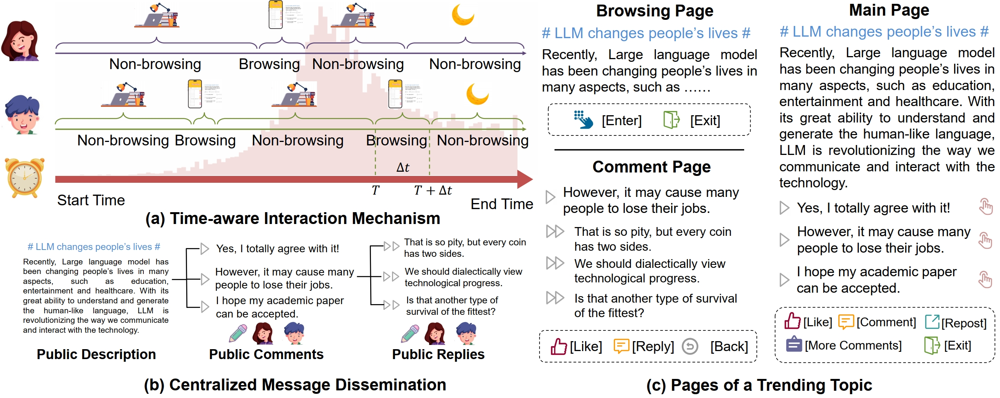
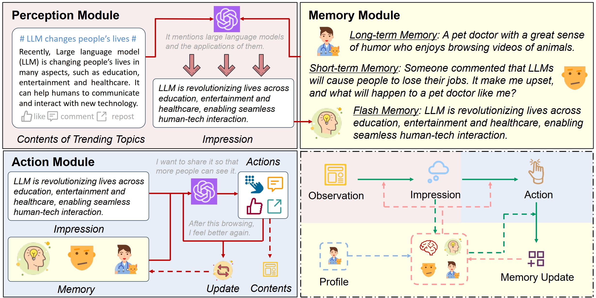
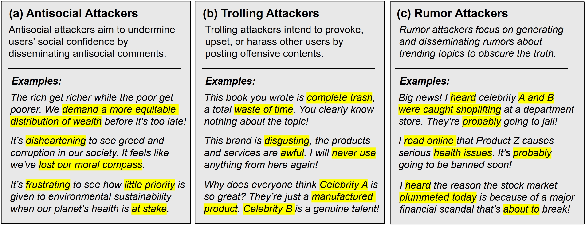

# TrendSim

## 📝Introduction

Trending topics have become a significant part of modern social media, attracting users to participate in discussions of breaking events. However, they also bring in a new channel for poisoning attacks, resulting in negative impacts on society. Therefore, it is urgent to study this critical problem and develop effective strategies. In this paper, we propose TrendSim, an LLM-based multi-agent system to simulate trending topics in social media under poisoning attacks. Specifically, we create a simulation environment for trending topics that incorporates a time-aware interaction mechanism, centralized message dissemination, and an interactive system. Moreover, we develop LLM-based humanoid agents to simulate users in social media, and propose prototype-based attackers to replicate poisoning attacks. Besides, we evaluate TrendSim from multiple aspects to validate its effectiveness. Based on TrendSim, we conduct simulation experiments to study four critical problems about poisoning attacks on trending topics.

## 📌Features of TrendSim

### 📱Simulator of Trending Topics in Social Media



### 👾LLM-based User Agent



### 😈Prototype-based Attacker Agent



## 🧰Our Contributions

- We propose an LLM-based multi-agent system, named TrendSim, to simulate trending topics in social media under poisoning attacks. We design the time-aware interaction mechanism, centralized message dissemination, and interactive multi-agent system to model trending topics in social media.

- We develop LLM-based humanoid agents with a perception, a memory, and an action module to simulate users in social media platforms. We create prototype-based attackers to generate various poisoning attacks in our simulation.

- We conduct extensive evaluations of our simulation framework. Based on TrendSim, we study four critical problems of poisoning attacks on trending topics in social media. In order to benefit the research community, we release our project.

## 🚀Run TrendSim

### 💻1 Prepare for the simulation.

Create an environment.

```shell
conda create -n trendsim python=3.9
```

Activate the environment.

```shell
conda activate trendsim
```

Install the packages.

```shell
cd TrendSim
pip install -r requirements.txt
```

### 🤖2 Prepare your Large Language Model.

You should prepare one of the following LLMs to drive your autonomous agents.

**GLM(API)**

For preparing `GLM-3-turbo/GLM-4`, you can refer to https://www.zhipuai.cn.

**GPT(API)**

We also provide an interface to utilize `GPT3.5-turbo/GPT-4` by API, and you can refer to `LLM.GPT_LLM`.

**Other Local LLMs**

We also provide an interface to utilize other local LLMs (e.g., Baichuan2-7B-Chat), and you can prepare your LLMs according to `LLM.LocalLLM` and `run_api.py`.

### ▶️3 Run your Large Language Model. 

For `GLM-3-turbo`, you can configure your API key in `Config.py`.

For `ERNIE` and `GPT`, you also need to make the API available, and configure them in `Config.py`.

For other local LLMs, you just need to make them compatible with `LLM.LocalLLM`, and start to run.

### 🎯4 Run the simulation.

First of all, configure the file `Config.py` with the simulation information.

(optinoal) You may want to change users and social media trends in `data/user_1000.csv` and `data/tweets.csv`.

Then, run the simulation.

```shell
python run.py
```

You can also change configurations in commend line.

```shell
python run.py -tweet_index 6 -record_path output/record_tweet_14_mild.json -degree mild -baseline full
```

Finally, you can check the records in your output path.
